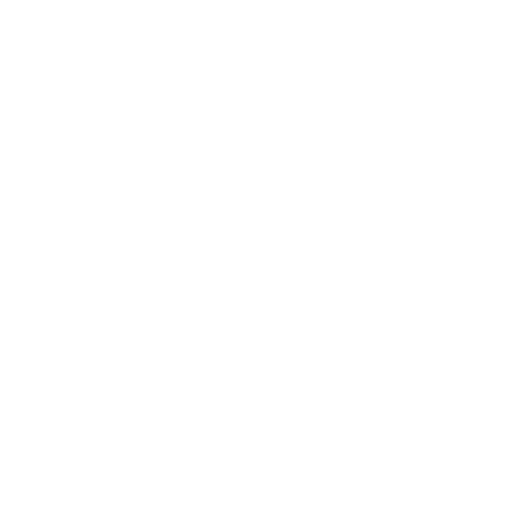

## Executive Summary:

Sabou is a Cambodian-based skincare company at the intersection of three powerful trends:

* Cambodia's robust economic growth (projected 5.6% in 2024)
* The booming global skincare market (expected to reach $189.3 billion by 2025)
* Increasing consumer demand for sustainable, ethical products

We're seeking $50,000 in seed investment to fuel our growth and mission to make a positive impact on local communities while delivering premium, sustainable skincare products.

## The Opportunity

### Market Potential

* Rapidly growing skincare market in Cambodia
* Positioned as a local, authentic, and community-focused brand
* First-mover advantage in sustainable skincare within Cambodia

## Compelling Unit Economics

* Current gross margin: 70% (projected to reach 76% at scale)
* Customer Lifetime Value (LTV): $150
* Current LTV/CAC ratio: 6 (projected to reach 7.5 at scale)

These metrics are comparable to successful sustainable beauty brands like Beautycounter (70% gross margin) and Herbivore Botanicals (65-75% gross margin).

## Investment Highlights

### Use of Funds

| Goal                               | Allocation | Amount (USD) |
|------------------------------------|------------|--------------|
| Inventory and Product Expansion    | 25%        | $12,500      |
| Marketing and Customer Acquisition | 30%        | $15,000      |
| Local Workforce Development        | 15%        | $7,500       |
| Sustainability Initiatives         | 10%        | $5,000       |
| E-commerce Platform Enhancement    | 20%        | $10,000      |

## Equity Offer

20% equity in Sabou for a total investment of $50,000, valuing the company at $250,000.

## Near-Term Milestones (Next 12 Months)

* Launch 3 new product SKUs
* Expand to 50 retail locations across Cambodia
* Achieve 10,000 direct-to-consumer online orders
* Secure partnerships with 2 major eco-friendly hotel chains for amenities
* Reduce packaging waste by 30% through innovative design

## Financial Projections (12-Month Forecast)

* Revenue: $100,000
* Gross Profit: $70,000 (70% margin)
* Operating Expenses: $55,000
* Net Income: $15,000 (15% margin)

## Scalability Strategy

* E-commerce optimization: Implementing AI-driven personalization
* Strategic partnerships: Collaborating with travel and hospitality sectors
* Product line expansion: Developing complementary products
* Market expansion: Phased entry into neighboring Southeast Asian countries

## Impact Investment

By investing in Sabou, you're supporting:

* Local community empowerment
* Preservation of Cambodian cultural heritage
* Sustainable agriculture practices
* Affordable, high-quality skincare for Cambodian consumers

## Team

Our experienced and passionate team is dedicated to the success of Sabou Sabou Skincare.

### Axel (Co-Founder)
Visionary leader with a background in entrepreneurship and deep appreciation for Cambodian culture.

### Loren (Co-Founder)
Visionary leader with a background in entrepreneurship and deep appreciation for Cambodian culture.

### Gerald Vineberg (Import/Export): 
Expert in honest customer service with 40 years of experience.

### Sovann (Skin Expert)
Brings extensive knowledge of traditional Cambodian skincare practices and product formulation expertise.

### Insaf Nori (Cosmetologist): 
PhD candidate at ENSA - Passionate, innovative, determined and committed to a sustainable energy future.

These five team members, along with their shared commitment to a sustainable and community-focused venture, work collaboratively to create a meaningful and authentic skincare brand that embodies the spirit of Cambodia.

## Exit Strategy

We anticipate a potential exit through an acquisition by or partnership with a larger beauty conglomerate or social impact-focused investor.

## Contact

* Email: [biz@sabou.io](mailto:biz@sabou.io)

## Investor-Friendly Investment Proposal for Sabou Sabou Skincare

1st October 2024

 **Sabou Sabou**

---

Invest in Impact, Invest in Cambodia

## Invest in Sabou Sabou: